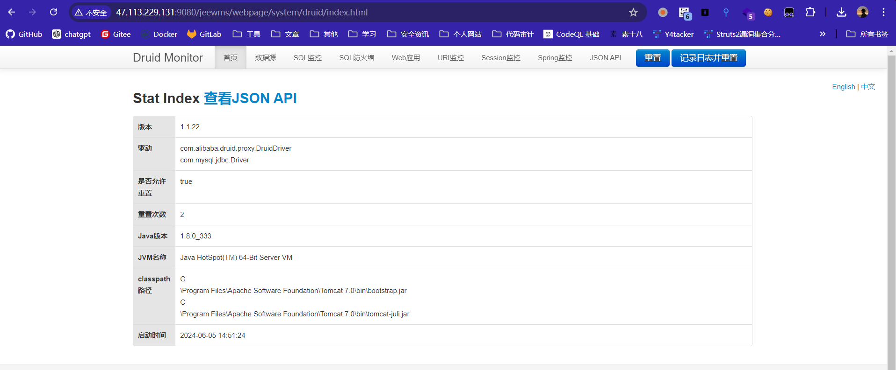

# JEEWMS v3.7

JEEWMS v3.7版本存在敏感信息泄露漏洞，无需登录即可获取后台数据库连接、Web应用配置信息、sql防火墙信息、流量信息、所有sql语句等

泄露url

本地：http://localhost:8080/jeewms_war_exploded/webpage/system/druid/sql.html

作者提供的远程示例：http://47.113.229.131:9080/jeewms/webpage/system/druid/index.html

url监控

## 解决方案

设置为登陆后可访问